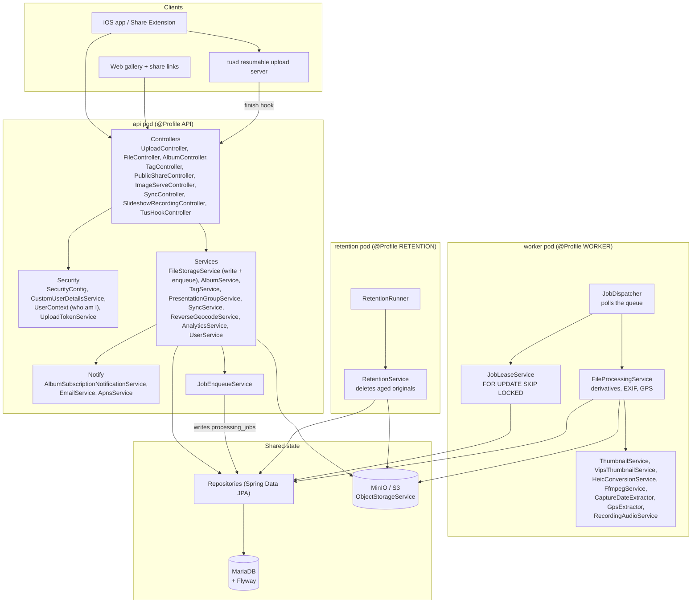
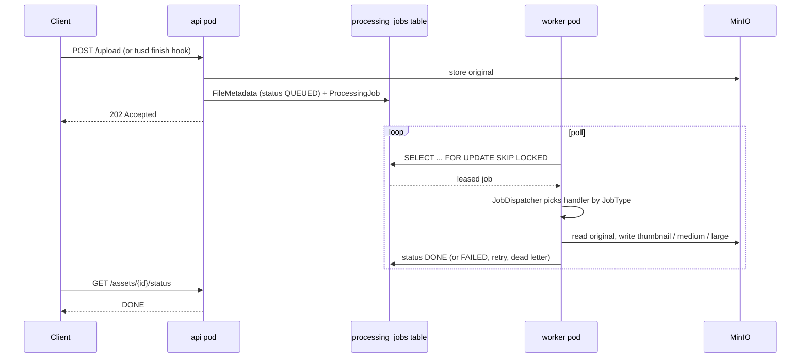
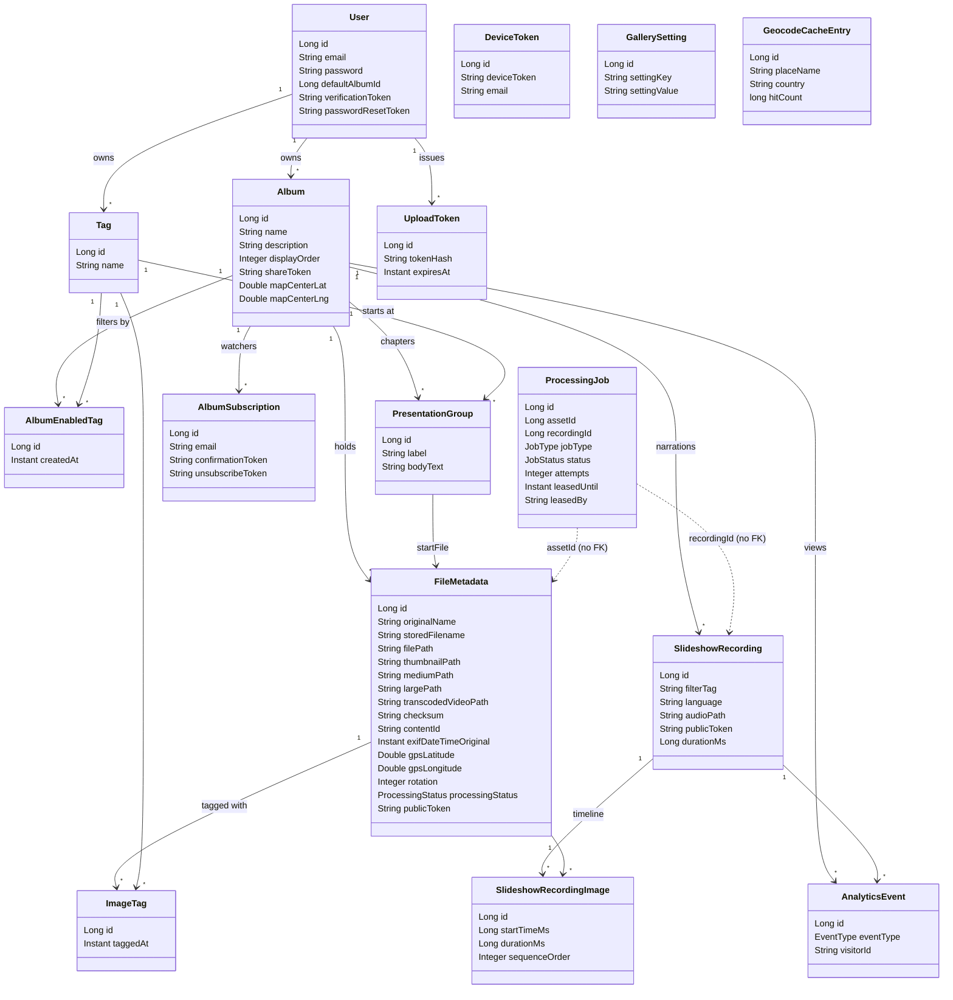

# Photo Upload Server - Spring Boot

Spring Boot server for receiving photo and video uploads from the macOS Share Extension.

## Features

- ✅ Single file upload endpoint
- ✅ Multiple file upload endpoint (up to 100 files)
- ✅ File type validation (images and videos only)
- ✅ Automatic unique filename generation
- ✅ Files stored on filesystem
- ✅ Metadata stored in MariaDB with JPA/Hibernate
- ✅ Database migrations managed with Flyway
- ✅ SHA-256 checksum calculation for uploaded files
- ✅ CORS enabled
- ✅ File size limit (500MB per file)
- ✅ List uploaded files
- ✅ Download files
- ✅ Health check endpoint

## Requirements

- Java 17 or higher
- Maven 3.6+
- Docker & Docker Compose (recommended) OR MariaDB 10.5+ / MySQL 8.0+

## Architecture

The same JAR boots as three roles, chosen by `SPRING_PROFILES_ACTIVE`:
`api` (serves HTTP), `worker` (drains the job queue), `retention` (nightly cleanup).
Beans are gated with `@Profile`, so a bean in the wrong role is a startup crash.

### Layers and their purpose



### The job pipeline

Slow work never runs inside a request. The api pod writes a row, the worker pod picks it up.



`JobType` values and what each one does:

|        JobType         |                                      Purpose                                      |
|------------------------|-----------------------------------------------------------------------------------|
| `PROCESS`              | Full first pass: derivatives, capture date, GPS.                                  |
| `ROTATE_LEFT`          | Turn an asset 90 degrees and rebuild derivatives.                                 |
| `REGEN_THUMBNAILS`     | Rebuild missing thumbnail / medium / large.                                       |
| `EXTRACT_CAPTURE_DATE` | Re-read the capture date from the original.                                       |
| `EXTRACT_GPS`          | Re-read the capture location from the original.                                   |
| `TRANSCODE_AUDIO_AAC`  | Make the AAC sibling of a slideshow recording. Here `asset_id` is a recording id. |

### Domain model



`ProcessingJob` has no foreign key on purpose. It points at either an asset id or a
recording id, so the queue table is reused instead of duplicated.

### Class groups and what they are for

|    Package     |                                             Purpose                                              |
|----------------|--------------------------------------------------------------------------------------------------|
| `controller`   | HTTP endpoints. Thin. They validate and call a service.                                          |
| `service`      | All business logic. Split by profile: api writes and reads, worker processes, retention deletes. |
| `repository`   | Spring Data JPA interfaces. The only place that talks to MariaDB.                                |
| `entity`       | JPA tables. Every field needs a Flyway column, or startup fails (`ddl-auto: validate`).          |
| `model`        | Request and response DTOs sent over HTTP. Never JPA entities.                                    |
| `mapper`       | MapStruct converters from entity to DTO.                                                         |
| `config`       | Beans and typed properties, plus `Profiles` (the api / worker / retention names).                |
| `security`     | Basic auth, share tokens, upload tokens, and `UserContext` (the current user).                   |
| `storage`      | `StoragePaths`: deterministic S3 keys from the asset id. Paths cannot drift.                     |
| `exception`    | Typed errors plus `GlobalExceptionHandler`, which maps them to status codes.                     |
| `health`       | `MinioHealthIndicator` for the actuator health endpoint.                                         |
| `util` / `web` | Range requests, MIME checks, upload backpressure filter.                                         |

## API Endpoints

### 1. Upload Single File

**POST** `/upload`

**Form Data:**

- `file`: The file to upload

**Example (curl):**

```bash
curl -X POST http://localhost:3000/upload \
  -F "file=@/path/to/photo.jpg"
```

**Response:**

```json
{
  "success": true,
  "file": {
    "originalName": "photo.jpg",
    "filename": "photo-1234567890-abc123.jpg",
    "size": 1024000,
    "mimetype": "image/jpeg",
    "path": "/path/to/uploads/photo-1234567890-abc123.jpg",
    "uploadedAt": "2025-10-06T21:00:00Z"
  }
}
```

### 2. Upload Multiple Files

**POST** `/upload/multiple`

**Form Data:**

- `files`: Array of files to upload

**Example (curl):**

```bash
curl -X POST http://localhost:3000/upload/multiple \
  -F "files=@/path/to/photo1.jpg" \
  -F "files=@/path/to/photo2.jpg"
```

**Response:**

```json
{
  "success": true,
  "count": 2,
  "files": [
    {
      "originalName": "photo1.jpg",
      "filename": "photo1-1234567890-abc123.jpg",
      "size": 1024000,
      "mimetype": "image/jpeg",
      "path": "/path/to/uploads/photo1-1234567890-abc123.jpg",
      "uploadedAt": "2025-10-06T21:00:00Z"
    },
    {
      "originalName": "photo2.jpg",
      "filename": "photo2-1234567891-def456.jpg",
      "size": 2048000,
      "mimetype": "image/jpeg",
      "path": "/path/to/uploads/photo2-1234567891-def456.jpg",
      "uploadedAt": "2025-10-06T21:00:00Z"
    }
  ]
}
```

### 3. List Files

**GET** `/files`

**Response:**

```json
{
  "success": true,
  "count": 5,
  "totalSize": 5120000,
  "files": [
    {
      "originalName": "photo.jpg",
      "filename": "photo-1234567890-abc123.jpg",
      "size": 1024000,
      "mimetype": "image/jpeg",
      "uploadedAt": "2025-10-06T21:00:00Z",
      "path": "/path/to/uploads/photo-1234567890-abc123.jpg"
    }
  ]
}
```

### 4. Download File

**GET** `/files/{filename}`

**Example:**

```
http://localhost:3000/files/photo-1234567890-abc123.jpg
```

### 5. Health Check

**GET** `/health`

**Response:**

```json
{
  "status": "ok",
  "timestamp": "2025-10-06T21:00:00Z",
  "uptime": 123.45
}
```

### 6. Root

**GET** `/`

Get API information and available endpoints.

## Authentication

All endpoints require HTTP Basic authentication, except for presentation share links that use a secret token.

- Protected (Basic Auth required): all endpoints by default, including upload, tagging, title updates, album CRUD, etc.
- Public via Share Token: selected GET endpoints for a specific album when a valid `token` query parameter is supplied.

Share token flow:

1. Create a share token for an album (requires Basic Auth):
   - POST `/albums/{id}/share` → `{ "success": true, "token": "<hex>" }`
2. Use the returned token to access presentation endpoints without Basic Auth by appending `?token=<hex>`:
   - GET `/albums/{id}?token=...`
   - GET `/albums/{id}/files?token=...`
   - GET `/files?albumId={id}&token=...`
   - Image files are accessed via public file tokens: `GET /i/{fileToken}` (no Basic Auth needed)
   - GET `/settings/title?token=...`
3. Revoke the share token (optional, requires Basic Auth):
   - DELETE `/albums/{id}/share`

Login check endpoint (requires Basic Auth):

- GET `/auth/check` → `{ "success": true, "email": "..." }` if credentials are valid; 401 otherwise.

Database contains a `users` table managed by Flyway. Seed at least one user row, for example via SQL:

```sql
INSERT INTO users (email, password) VALUES ('admin@example.com', 'changeme');
```

Note: Passwords are stored in plaintext for simplicity. For production, switch to a password hash (e.g., BCrypt) and update the password check accordingly.

## Supported File Types

### Images

- JPEG/JPG
- PNG
- GIF
- HEIC/HEIF
- WebP
- TIFF
- BMP

### Videos

- MP4
- MOV (QuickTime)
- AVI
- WMV
- FLV
- MKV
- WebM
- M4V

## Development

### Enable Hot Reload

Spring Boot DevTools is included for automatic restart during development.

### Build without Tests

```bash
mvn clean package -DskipTests
```

### Custom Logging

Edit logging level in `application.properties`:

```properties
logging.level.com.example.photoupload=DEBUG
```

### Creating Database Migrations

To create a new Flyway migration:

1. Create a new SQL file in `src/main/resources/db/migration/`
2. Follow the naming convention: `V{version}__{description}.sql`
   - Example: `V2__add_tags_column.sql`
3. Write your SQL DDL statements
4. Restart the application - Flyway will automatically apply the migration

**Example migration:**

```sql
-- V2__add_tags_column.sql
ALTER TABLE file_metadata ADD COLUMN tags VARCHAR(512);
```

## Integration with macOS Extension

The Swift upload service is configured to use this server. The endpoint is:

```
http://localhost:3000/upload
```

When you run the server, the Share Extension will automatically upload files to it.

## Testing

### Test with curl

**Single upload:**

```bash
curl -X POST http://localhost:3000/upload \
  -F "file=@test-image.jpg"
```

**Multiple upload:**

```bash
curl -X POST http://localhost:3000/upload/multiple \
  -F "files=@test1.jpg" \
  -F "files=@test2.jpg"
```

**List files:**

```bash
curl http://localhost:3000/files
```

**Health check:**

```bash
curl http://localhost:3000/health
```

## Error Handling

The server handles the following errors:

- **No file uploaded** - 400 Bad Request
- **Invalid file type** - 400 Bad Request
- **File too large** - 400 Bad Request
- **File not found** - 404 Not Found
- **Server errors** - 500 Internal Server Error

## Security Notes

⚠️ **This is a development server. For production:**

1. Add authentication/authorization
2. Restrict CORS to specific origins
3. Add rate limiting
4. Implement file scanning for malware
5. Use HTTPS
6. Add request validation
7. Implement proper logging
8. Add monitoring
9. Use a reverse proxy (nginx/Apache)
10. Configure proper file permissions
